# Keep - Efficient Video Downloader

A simple and efficient video downloader that allows users to download videos from YouTube with rich content including embedded thumbnails, subtitles, and metadata.

## Features

- Download videos from YouTube with embedded thumbnails, subtitles, and metadata
- Supports multiple video formats and resolutions
- Simple and user-friendly command-line interface
- Error handling and informative messages

## Prerequisites

- Python 3.13+
- FFmpeg
- yt-dlp
- rich

## Installation

1. Clone or download this repository

2. Install FFmpeg (required for embedding thumbnails, subtitles, and metadata):

   **Windows**
   
   Install using Scoop package manager:
   ```powershell
   scoop bucket add main
   scoop install main/ffmpeg
   ```
   
   Or download manually from [FFmpeg official site](https://www.gyan.dev/ffmpeg/builds/) and add to PATH.

   **macOS**
   
   Install using Homebrew:
   ```bash
   brew install ffmpeg
   ```

   **Linux (Ubuntu/Debian)**
   
   ```bash
   sudo apt update
   sudo apt install ffmpeg
   ```

3. Install Python dependencies:
   ```bash
   pip install -r requirements.txt
   ```

## Usage

**Note:** It is recommended to use authentication cookies for reliable downloads. Export your YouTube cookies using [this guide](https://github.com/yt-dlp/yt-dlp/wiki/Extractors#exporting-youtube-cookies) and save as `youtube.txt` in the `cookies` folder.

Quick start:
```bash
python main.py
```

For more options:
```bash
python main.py --help
```


## Demo


## Project Structure

```
keep/
├── __init__.py              # Package initializer
├── main.py                  # Main entry point and CLI handler
├── youtube.py               # YouTube downloader implementation
├── utils.py                 # Utility classes and helpers
├── requirements.txt         # Python dependencies
├── README.md                # Project documentation
├── cookies/
│   └── youtube.txt          # YouTube authentication cookies
├── src/
│   ├── args help.png        # CLI arguments help screenshot
│   └── demo.gif             # Demo animation
├── test/
│   └── test_youtube.py      # Unit tests
└── __pycache__/             # Python bytecode cache
```

## Architecture

The project follows a modular design with the following key components:

### Classes

- **`Downloader`** (`youtube.py`): Handles video downloading from YouTube using yt-dlp. Includes dependency checking, video information fetching, and embedding of thumbnails, subtitles, and metadata.
- **`Utils`** (`utils.py`): Provides utility functions for internet connectivity checks and URL recognition.
- **`LinkError` and `FileError`** (`utils.py`): Custom exception classes for error handling.
- **`handler`** (`main.py`): Main controller that directs the application based on command-line arguments.
- **`main`** (`main.py`): Entry point that handles command-line argument parsing.

All classes and methods include docstrings following the Google Python Style Guide.

### Class Diagram



## Built With

- [Python](https://www.python.org/) - Programming language
- [yt-dlp](https://github.com/yt-dlp/yt-dlp) - Video downloader
- [rich](https://rich.readthedocs.io/) - Terminal formatting
- [FFmpeg](https://www.ffmpeg.org/) - Media processing

## Contributing

Contributions are welcome! Please feel free to submit issues or pull requests.

## License

This project is licensed under the MIT License - see the LICENSE file for details.

## Acknowledgements

- [yt-dlp](https://github.com/yt-dlp/yt-dlp)
- [rich](https://rich.readthedocs.io/en/stable/)
- [FFmpeg](https://www.ffmpeg.org/)
- [Google Python Style Guide](https://google.github.io/styleguide/pyguide.html)
